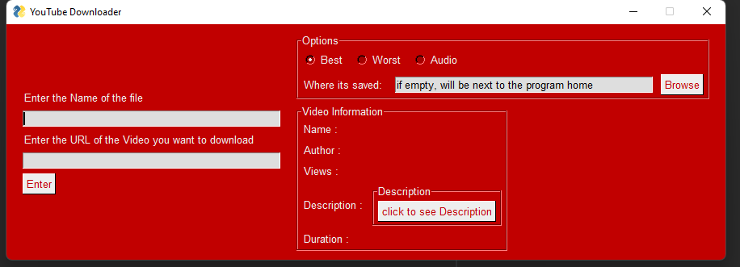
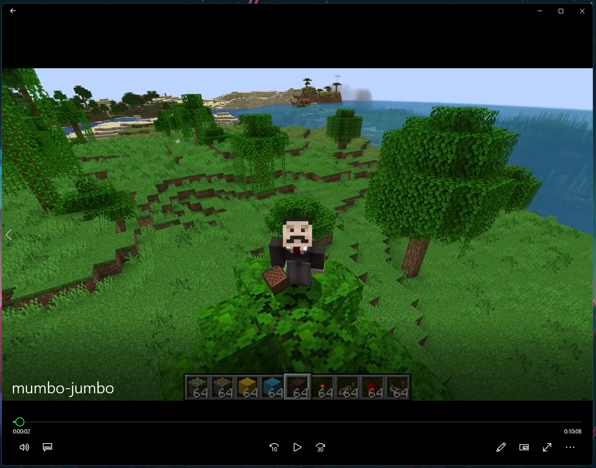

# must have [python 3.10](https://www.python.org/downloads/) or higher

# Youtube Downloader v.1.2

the easiest way to download a YouTube video.

tells you the video information

easily see the Description (press any key to close it)

has download options

enter any name (the program will automaticly add .mp4 and .mp3)

save the video Anywhere on your hard-drive

after you filled out the info and options

press enter, it should take a while to download (p.s it might say not responding that okay)

it should be done, and you can use the video/audio

credit:

    mumbo jumbo for the example video